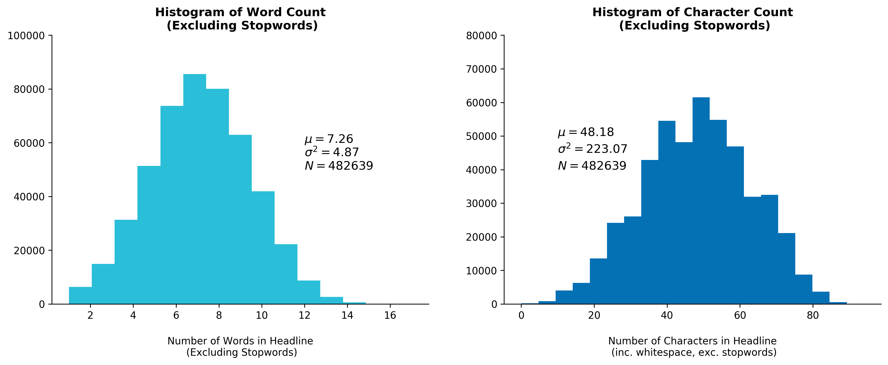

# Singapore News Headlines RNN Generator


An application that generates news headlines using a recurrent neural network (RNN) trained on approximately 500,000 headlines from a news agency in Singapore. The dockerized application includes an API enpoint served using Flask, gunicorn, and Nginx. The network is trained using Tensorflow 1.14. Try generating some news headlines at https://royhung.com/sg-news-rnn

## Quickstart

To start the API server, ensure docker is installed and run the following command in the project root directory:

```bash
$ docker-compose up
```

This will start an Nginx docker container and a flask container that serves the application on port 5001.<br> You can access the API at http://my-public-ip:5001 or http://localhost:5001 if you are running the app locally.


## API Reference

### Generate News Headlines
POST endpoint for a RESTful API that generates random news headlines from a RNN trained on news headlines from a local newspaper dataset. 

```bash
POST /headlines
```

#### Request POST JSON Example

```json
{
    "n_headlines": 5,
    "start_string": "Singapore "
}

```
| Property | Type |Description | Required
| --- | --- | :- | --- |
|``` n_headlines ```| Integer | Number of headlines to generate. Maximum number returned is 10 headlines. Defaults to 5 if parameter not provided | No |
|``` start_string ```| String | Starting text for the first headline. Serves as the RNN input. ``` start_string ``` Defaults to "Singapore " if not provided. Unrecognized characters will be coerced to whitespace.   | No |

#### Response JSON Example

```json
["Singapore The Spirit In New Hongbao To End Production Trick",
 "Asia Briefs South Korea Ferry Disaster Victims Of James Hits The World",
 "Warriors Get A Threat To The Sky",
 "Airasia Flight Qz8501 Dead State For Role In More Than 68000 Raised For The Store Of Singapore And India"
 "The Books For Becoming A Storm"]
```

## Dataset

The raw headlines dataset contains 500,597 URLs from the Straits Times Singapore newspaper. For SEO purposes, most news agencies "slugify" their news article headlines and include them into the URL path. Take for example the headline: 

**"Raffles Hotel's reopening a chance for Kit Chan to walk down memory lane"**

The corresponding URL path turns out to be:

**/lifestyle/raffles-hotels-reopening-a-chance-for-kit-chan-to-walk-down-memory-lane**

Obtaining the headlines dataset is a matter of cleaning these URLs. A more detailed process for data cleaning can be found in this [notebook](./notebooks/1_st_headlines_clean.ipynb).

### Summary of Preprocessed Data

Full EDA of this dataset and code can be found in this [notebook](./notebooks/2_st_headlines_eda.ipynb).


```python
# Sample of cleaned dataset
import pandas as pd
pd.options.display.max_colwidth = 150
df = pd.read_csv("./data/st_sitemap_clean.csv")
```


```python
df.sample(5)
```


<div>
<table border="1" class="dataframe">
  <thead>
    <tr style="text-align: right;">
      <th></th>
      <th>Headline</th>
      <th>Category</th>
      <th>Wordcount</th>
      <th>Charcount</th>
    </tr>
  </thead>
  <tbody>
    <tr>
      <td>240798</td>
      <td>Starhub Lowers Rates For Line Only Plans Following Rivals New Plans</td>
      <td>Tech</td>
      <td>11</td>
      <td>67</td>
    </tr>
    <tr>
      <td>109008</td>
      <td>Georgia Father Charged With Murder In Sons Hot Car Death</td>
      <td>World/Americas</td>
      <td>10</td>
      <td>56</td>
    </tr>
    <tr>
      <td>49284</td>
      <td>Singapore Scientists Join First International Ocean Sampling Day</td>
      <td>Singapore/Environment</td>
      <td>8</td>
      <td>64</td>
    </tr>
    <tr>
      <td>288022</td>
      <td>Syrian Opposition Agrees To Participate In Geneva Peace Talks</td>
      <td>World</td>
      <td>9</td>
      <td>61</td>
    </tr>
    <tr>
      <td>379611</td>
      <td>Rws Plans Wont Hit Genting Berhads Credit Rating Fitch</td>
      <td>Business</td>
      <td>9</td>
      <td>54</td>
    </tr>
  </tbody>
</table>
</div>





## More Information
For a more detailed writeup on the dataset and code, visit https://royhung.com/sg-news-rnn
